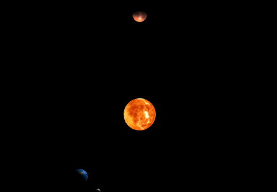
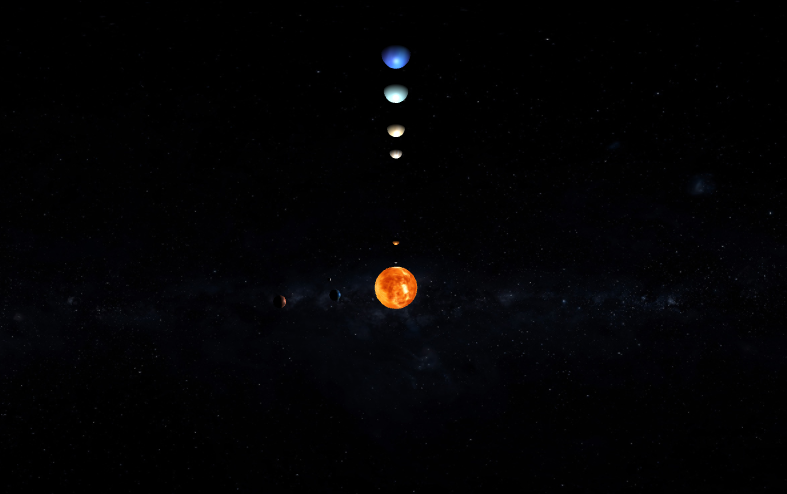

# Sistema Solar 2020.1 8-)

## Introdução

O seguinte trabalho foi feito para a matéria de Computação Gráfica da UFRJ, que embora seja de 2020.1, ocorreu somente em Dezembro de 2020, devido a pandemia do Covid-19. Para realizar esse trabalho, foi utilizado a biblioteca Three.js (https://threejs.org), e executando através de um servidor python construido com o simples comando `python -m http.server`, executado na pasta do projeto.

## Objetivo

O objetivo do trabalho está num pdf na pasta _Description_. Mas é basicamente construir o sistema solar e seus movimentos básicos em 3D!

## Etapas

O trabalho foi programado em 3 etapas: 
1 - Fazer o básico apenas, com a Lua, Sol, Terra e Marte;
2 - Inserir todos os outros planetas sem movimento;
3 - Por fim, colocar todos os movimentos e um decaimento de iluminação com a distância

;

;

;
